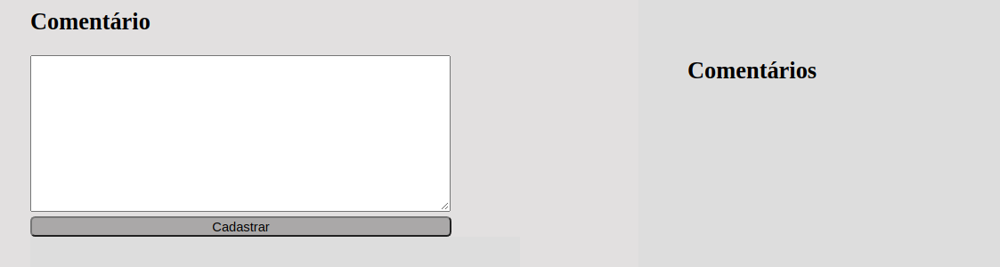

# Desenvolvimento de assistentes virtuais

## Feito com NodeJs e MySQL

Foi desenvolvida uma aplicação em que o usuário escreve qualquer comentário na 
caixa de texto do lado direito da página, que deve ser salva no banco de dados e
ficar a amostra do lado esquerdo, o usuário tem a opção de ouvir a leitura do comentário
clicando no botão(ouvir) logo acima da frase.

### Frameworks usados no teste

* express 
`npm install express --save` | <https://www.npmjs.com/package/express>

* sequelize 
`npm install --save sequelize` | <https://www.npmjs.com/package//sequelize>
para trabalhar com o banco de dados mySQL e nodeJs instalei a dependência mysql2 `npm install --save mysql2`

* handlebars 
`npm install --save express-handlebars` | <https://www.npmjs.com/package/express-handlebars>
